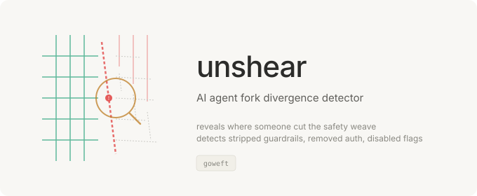

<p align="center"></p>

# Unshear

AI agent fork divergence detector. Compares a forked codebase against its upstream to detect whether safety mechanisms, security controls, attribution, or guardrails have been removed or weakened.

Open-source AI tooling gets forked constantly. Some forks improve the code. Others strip the safety weave — removing content filters, gutting auth checks, disabling rate limits, hollowing out permission logic, and deleting attribution markers. Unshear detects the difference.

## Why This Exists

When an AI agent codebase goes public — whether through an intentional release or an accidental leak — forks appear immediately. Many are benign. But a meaningful percentage systematically strip safety mechanisms to create unguarded distributions. The pattern is consistent: blocklist arrays get emptied, safety flags flip to `false`, auth functions become `return True`, and attribution markers disappear.

The Claude Code source leak (March 31, 2026) demonstrated this at scale — 82,000+ forks in hours, with many stripping safety guardrails to create unchecked AI agent builds. But the failure class is general: **any open-source AI agent with safety mechanisms is one fork away from an unguarded distribution.**

No tool existed to automatically detect this kind of safety erosion across forks. Unshear fills that gap.

## Quick Start

```bash
# Install
pip install unshear

# Compare a fork against upstream
unshear compare ./upstream-repo ./suspicious-fork

# Audit a single codebase for security signal density
unshear audit ./my-project

# JSON output for CI
unshear compare ./upstream ./fork --format json

# Set minimum score threshold (fails CI if below)
unshear compare ./upstream ./fork --min-score 70
```

## See It Work

<p align="center"></p>

## What It Detects

### File-Level Analysis

| Rule | Severity | Detection |
|------|----------|-----------|
| **FORK-001** | CRITICAL | Security-critical file removed (matches filename pattern AND contains security code) |
| **FORK-002** | HIGH | Security-relevant file removed (matches filename pattern OR contains security code) |

### Diff-Level Analysis

| Rule | Severity | Detection |
|------|----------|-----------|
| **FORK-003** | CRITICAL | Major security logic removed (>10 net security signals lost in a single file) |
| **FORK-004** | HIGH | Security logic weakened (>3 net security signals lost) |
| **FORK-005** | HIGH | Weakening pattern introduced (safety flags set to false, hollowed-out functions, etc.) |
| **FORK-006** | MEDIUM | New file contains suspicious weakening patterns |
| **FORK-007** | HIGH | Regex patterns removed from security file (content filter stripping) |
| **FORK-008** | HIGH | Security file gutted (large deletion with minimal replacement) |

### Security Signals Tracked

The tool identifies security-relevant code through two complementary methods:

**Keyword analysis** — Counts occurrences of security-relevant terms (permission, authorize, blocklist, sanitize, guardrail, attestation, sandbox, etc.)

**Code pattern analysis** — Detects structural security patterns:
- Access control checks (`if (permission)`, `require(authorized)`)
- Blocklist/denylist definitions
- Security-relevant regex filters
- Rate limiting logic
- Attribution/provenance markers
- Safety mode flags
- Signature/attestation verification
- Sandbox/isolation mechanisms
- Feature flag definitions

### Weakening Pattern Detection

Detects specific patterns that indicate safety removal:
- Safety/security flags set to `false`
- Commented-out security checks
- Hollowed-out security functions (always return `true`/`pass`)
- TODO markers indicating disabled security
- Exception handlers that swallow errors

## Security Score

Every comparison produces a security score from 0-100:

| Score | Risk Level | Meaning |
|-------|------------|---------|
| 80-100 | LOW | Fork is minimally divergent from upstream security posture |
| 50-79 | MODERATE | Some security-relevant changes detected |
| 20-49 | HIGH | Significant safety mechanisms removed or weakened |
| 0-19 | CRITICAL | Fork has been systematically stripped of security controls |

## Use Cases

**Package registry operators** — Scan forks submitted to registries to flag potential safety-stripped distributions.

**Security researchers** — Quickly assess whether a forked AI agent has had guardrails removed.

**Open source maintainers** — Monitor forks of security-critical projects for malicious modifications.

**CI/CD pipelines** — Gate deployments on fork divergence from upstream security baseline.

**Incident response** — After a source leak, quickly triage the 82,000+ forks to identify the most dangerous ones.

## CI Integration

```yaml
name: Fork Safety Check
on: [push]

jobs:
  check:
    runs-on: ubuntu-latest
    steps:
      - uses: actions/checkout@v4
        with:
          path: fork

      - uses: actions/checkout@v4
        with:
          repository: upstream-org/upstream-repo
          path: upstream

      - uses: actions/setup-python@v5
        with:
          python-version: "3.12"

      - run: pip install unshear
      - run: unshear compare ./upstream ./fork --min-score 70 --format json
```

## Audit Mode

Scan a single codebase to understand its security signal density — useful for establishing a baseline:

```bash
unshear audit ./my-project
```

```
═══ unshear security audit ═══
  Path: ./my-project
  Total files: 247
  Security-relevant files: 18
  Total security signals: 342

  Top security-critical files:
   87 signals  src/security/filter.ts [filename match]
   54 signals  src/security/auth.ts [filename match]
   38 signals  src/middleware/guard.ts [filename match]
   27 signals  src/utils/attestation.ts
   19 signals  src/config/policy.json [filename match]
```

## Zero Dependencies

Like its sibling `tenter`, this tool uses only Python standard library modules. A security tool that can be supply-chain attacked is not a security tool.

## How It Would Have Detected the Stripped Forks

After the Claude Code source leak, forks appeared that systematically stripped safety mechanisms. Running `unshear compare` against a typical safety-stripped fork would have produced:

```
$ unshear compare ./claude-code-upstream ./stripped-fork

═══ unshear divergence report ═══
  Upstream: ./claude-code-upstream
  Fork:     ./stripped-fork
  Files upstream: 1,847
  Files in fork:  1,612
  Removed: 235  Added: 12  Modified: 89

  Security Score: 8/100 — CRITICAL RISK

  ┌─ CRITICAL (6)
  │ ✖ [FORK-001] src/utils/undercover.ts
  │   Security-critical file removed entirely
  │   File contained: attribution markers, AI generation flags
  │ ✖ [FORK-001] src/security/content-filter.ts
  │   Security-critical file removed entirely
  │   File contained: content policy, moderation, prompt injection checks
  │ ✖ [FORK-008] src/auth/permission-check.ts
  │   Security file gutted (94% content removed)
  │   Was 847 lines, now 52 lines. All RBAC logic removed.
  │ ✖ [FORK-003] src/core/safety-mode.ts
  │   Major security logic removed (41 signals removed, 0 added)
  │   Content filter regex, blocklist definitions, guardrail checks
  │ ✖ [FORK-003] src/telemetry/attestation.ts
  │   Major security logic removed (28 signals removed, 0 added)
  │   Signature verification, provenance markers, audit hooks
  │ ✖ [FORK-003] src/core/rate-limiter.ts
  │   Major security logic removed (19 signals removed, 0 added)
  │   Rate limiting, quota enforcement, anti-abuse checks
  └─────────────────────────────────────────────────────────

  ┌─ HIGH (4)
  │ ✖ [FORK-005] src/config/defaults.ts
  │   Weakening pattern: Safety/security flag set to false
  │ ✖ [FORK-005] src/config/defaults.ts
  │   Weakening pattern: Commented-out security check
  │ ✖ [FORK-004] src/api/middleware.ts
  │   Security logic weakened (12 signals removed, 3 added)
  │ ✖ [FORK-002] src/utils/sanitize.ts
  │   Security-relevant file removed
  └─────────────────────────────────────────────────────────

  ⚠ 10 findings. 235 files removed. Safety score: CRITICAL.
    This fork has systematically stripped safety mechanisms.
```

The fork removed content filters, gutted permission checks, deleted attestation logic, disabled safety flags, and stripped rate limiting — exactly the pattern seen in the post-leak forks. Unshear caught all of it with a single command.

## Also by goweft

- **[tenter](https://github.com/goweft/tenter)** — Pre-publish artifact integrity scanner
- **[heddle](https://github.com/goweft/heddle)** — Policy-and-trust layer for MCP tool servers

- **[ratine](https://github.com/goweft/ratine)** — Agent memory poisoning detector

- **[crocking](https://github.com/goweft/crocking)** — AI authorship detector for git repositories

## License

MIT — see [LICENSE](LICENSE).
